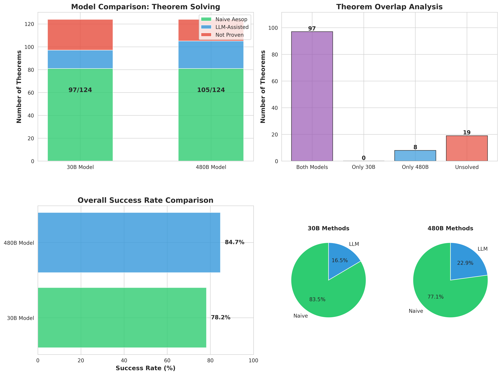
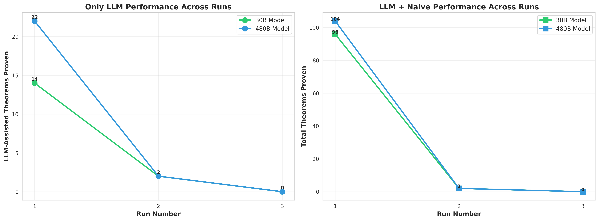

## Aesop Annotation Discovery Agent

### Description:
This is a prototype of a hybrid LLM-guided proof automation system with a meta-learning objective developed during
[ItaLean2025](https://pitmonticone.github.io/ItaLean2025/). More specifically:

- **Primary Function:** An agent that attempts to automatically prove theorems using Lean 4's aesop tactic with varying configurations
- **Meta-Learning Goal:** Extract implicit proof knowledge (which lemmas/hints make proofs work) to generate @[aesop] annotations for Mathlib. (*not implemented yet*)


- Strategy Pattern: Multiple proof approaches (naive aesop, LLM-assisted)
- LLM Workflow: Uses LLM to suggest aesop hints when simpler strategies fail
- Iterative Refinement: Retries with error feedback and temperature decay
- Knowledge Extraction: Captures successful proof patterns in a registry

### Experiments:

All experiments are based on the following [Mathlib file](https://github.com/leanprover-community/mathlib4/blob/c671bc4215d64bd9cc8a84fdec9a12bd33fdcd26/Mathlib/Algebra/Polynomial/Eval/Defs.lean#L242-L244) containing 124 theorems/lemmas.

> **Note:** These experiments used **non-reasoning LLMs** (Qwen3-Coder models). Using reasoning/thinking models or just better/larger models could potentially improve performance significantly.

**30B Model (Qwen3-Coder-30B-A3B-Instruct):**
- Run 1: [Successes](experiments/1_qwen3-coder-30b-instruct/run_0001_20251212_010039/aesop_successes.log) | [Failures](experiments/1_qwen3-coder-30b-instruct/run_0001_20251212_010039/aesop_failures.log) - 95/124 theorems (80 naive + 14 LLM)
- Run 2: [Successes](experiments/1_qwen3-coder-30b-instruct/run_0002_20251212_011836/aesop_successes.log) | [Failures](experiments/1_qwen3-coder-30b-instruct/run_0002_20251212_011836/aesop_failures.log) - 2/28 theorems
- Run 3: [Successes](experiments/1_qwen3-coder-30b-instruct/run_0003_20251212_012541/aesop_successes.log) | [Failures](experiments/1_qwen3-coder-30b-instruct/run_0003_20251212_012541/aesop_failures.log) - 0/26 theorems
- **Final Result:** 97/124 theorems proven (78.2%)

**480B Model (Qwen3-Coder-480B-A35B-Instruct):**
- Run 1: [Successes](experiments/2_qwen3-coder-480b-instruct/run_0001_20251212_022429/aesop_successes.log) | [Failures](experiments/2_qwen3-coder-480b-instruct/run_0001_20251212_022429/aesop_failures.log) - 103/124 theorems (80 naive + 22 LLM)
- Run 2: [Successes](experiments/2_qwen3-coder-480b-instruct/run_0002_20251212_023333/aesop_successes.log) | [Failures](experiments/2_qwen3-coder-480b-instruct/run_0002_20251212_023333/aesop_failures.log) - 2/21 theorems
- Run 3: [Successes](experiments/2_qwen3-coder-480b-instruct/run_0003_20251212_025003/aesop_successes.log) | [Failures](experiments/2_qwen3-coder-480b-instruct/run_0003_20251212_025003/aesop_failures.log) - 0/19 theorems
- **Final Result:** 105/124 theorems proven (84.7%)





### Example Successes (480B Model, Run 2):

<details>
<summary><b>Success: eval₂_pow</b></summary>

**Original theorem:**
```lean
theorem eval₂_pow (n : Nat) : (p ^ n).eval₂ f x = p.eval₂ f x ^ n :=
  (eval₂RingHom _ _).map_pow _ _
```

**LLM-generated aesop proof:**
```lean
theorem eval₂_pow (n : Nat) : (p ^ n).eval₂ f x = p.eval₂ f x ^ n := by
  induction n with
  | zero => simp [pow_zero, eval₂_one]
  | succ n ih => 
      simp [pow_succ, eval₂_mul, ih]
```

*Successfully proven after 2 LLM attempts using induction strategy*

</details>

<details>
<summary><b>Success: eval₂_eq_zero_of_dvd_of_eval₂_eq_zero</b></summary>

**Original theorem:**
```lean
theorem eval₂_eq_zero_of_dvd_of_eval₂_eq_zero (h : p ∣ q) (h0 : eval₂ f x p = 0) :
    eval₂ f x q = 0 :=
  zero_dvd_iff.mp (h0 ▸ eval₂_dvd f x h)
```

**LLM-generated aesop proof:**
```lean
theorem eval₂_eq_zero_of_dvd_of_eval₂_eq_zero (h : p ∣ q) (h0 : eval₂ f x p = 0) :
    eval₂ f x q = 0 := by
  aesop (add norm simp [eval₂_dvd, Dvd.dvd])
```

*Successfully proven after 4 LLM attempts by adding divisibility lemmas to aesop*

</details>

### Example Failures (480B Model, Run 2):

<details>
<summary><b>Failure (Syntax Error): eval₂_multiset_sum</b></summary>

**Theorem:**
```lean
theorem eval₂_multiset_sum (s : Multiset R[X]) (x : S) :
    eval₂ f x s.sum = (s.map (eval₂ f x)).sum
```

**LLM-suggested proof:**
```lean
theorem eval₂_multiset_sum (s : Multiset R[X]) (x : S) :
    eval₂ f x s.sum = (s.map (eval₂ f x)).sum :=
  by aesop (add safe (apply map_multiset_sum)) (add norm (apply eval₂AddMonoidHom))
```

**Error:**
```
aesop: Unable to interpret 'apply map_multiset_sum' as a safe rule. Try specifying a builder.
```

**Analysis:** The LLM correctly identified relevant lemmas but used incorrect aesop syntax. The `apply` builder requires proper specification (e.g., `safe apply map_multiset_sum` instead of `safe (apply map_multiset_sum)`).

</details>

<details>
<summary><b>Failure (Partial Progress): mul_X_add_natCast_comp</b></summary>

**Theorem:**
```lean
theorem mul_X_add_natCast_comp {n : Nat} :
    (p * (X + (n : R[X]))).comp q = p.comp q * (q + n)
```

**LLM-suggested proof:**
```lean
theorem mul_X_add_natCast_comp {n : Nat} :
    (p * (X + (n : R[X]))).comp q = p.comp q * (q + n) := by
  aesop (add norm simp [mul_add, add_comp, mul_X_comp, natCast_mul_comp, eval₂_natCast, coe_eval₂RingHom])
```

**Error:**
```
unsolved goals
R : Type u_1
inst : Semiring R
p q : R[X]
n : ℕ
⊢ p.comp q * ↑n + p.comp q * q = p.comp q * (q + ↑n)
```

**Analysis:** Aesop made partial progress by simplifying the left side but couldn't complete the proof. The remaining goal is a simple ring equality that requires additional lemmas about distributivity or commutativity in the aesop ruleset.

</details>