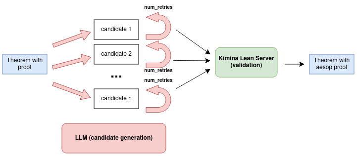

## Aesop Annotation Discovery Agent

### Description:
This is a prototype of a hybrid LLM-guided proof automation system with a meta-learning objective developed during
[ItaLean2025](https://pitmonticone.github.io/ItaLean2025/). More specifically:

- **Primary Function:** An agent that attempts to automatically prove theorems using Lean 4's aesop tactic with varying configurations
- **Meta-Learning Goal:** Extract implicit proof knowledge (which lemmas/hints make proofs work) to generate @[aesop] annotations for Mathlib.

- Strategy Pattern: Multiple proof approaches (naive aesop, LLM-assisted)
- LLM Workflow: Uses LLM to suggest aesop hints when simpler strategies fail
- Iterative Refinement: Retries with error feedback and temperature decay
- Knowledge Extraction: Captures successful proof patterns in a registry

### Experiments:

All experiments are based on the following [Mathlib file](https://github.com/leanprover-community/mathlib4/blob/c671bc4215d64bd9cc8a84fdec9a12bd33fdcd26/Mathlib/Algebra/Polynomial/Eval/Defs.lean#L242-L244).